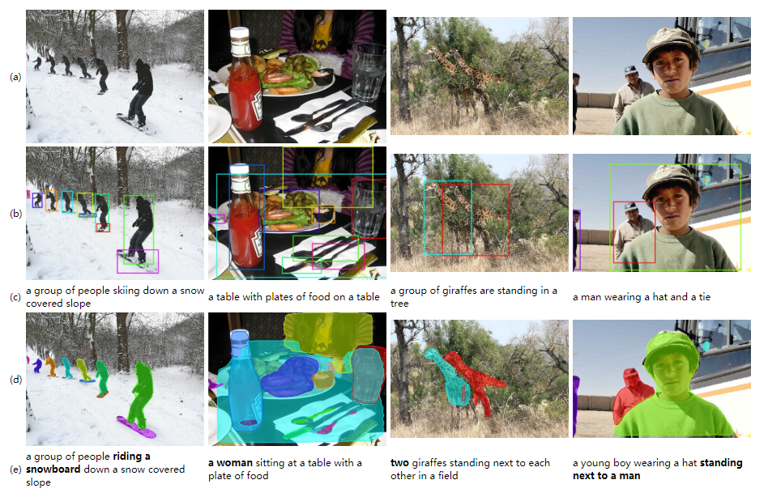
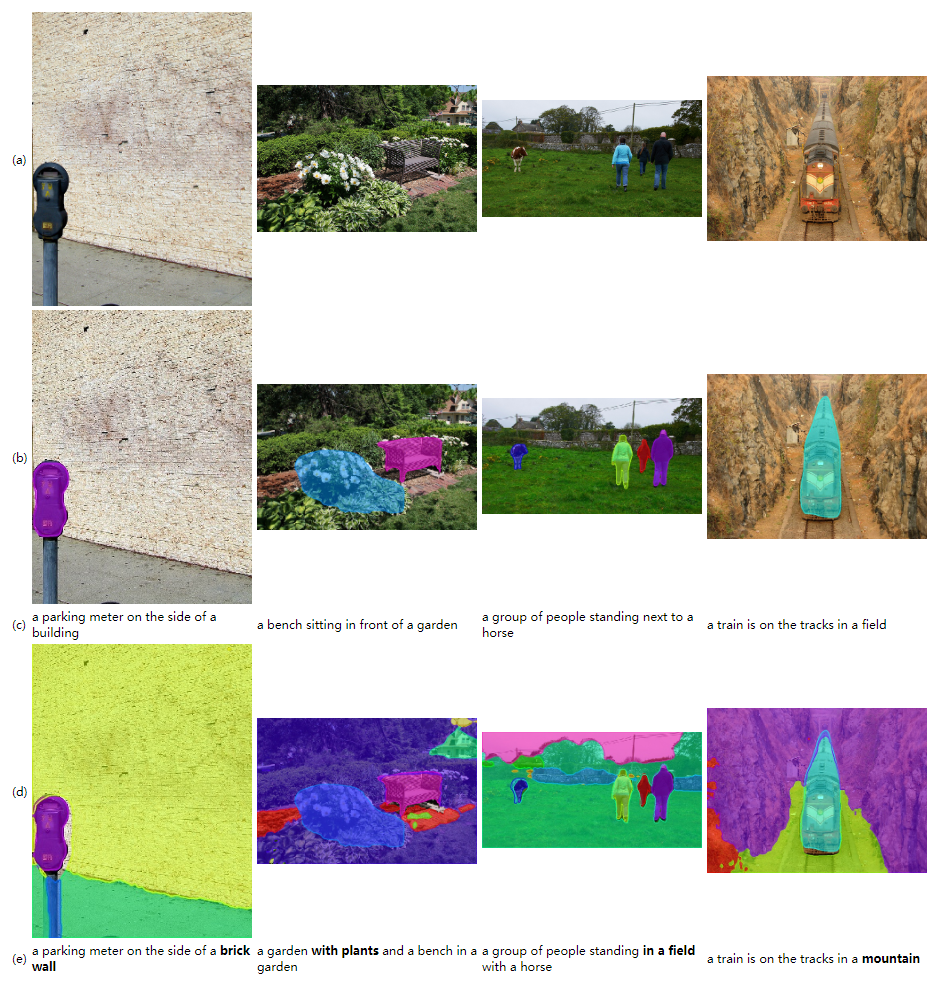
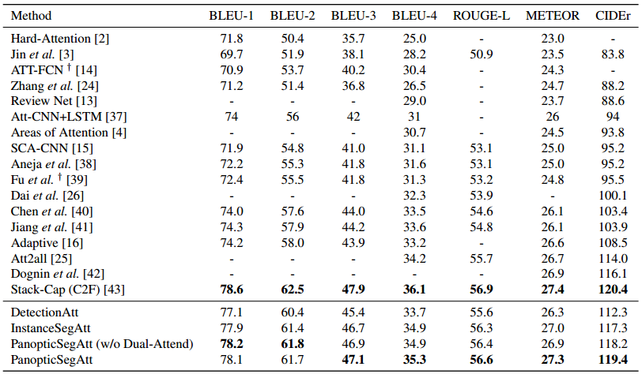
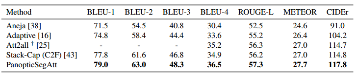
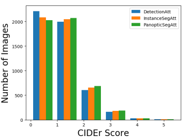
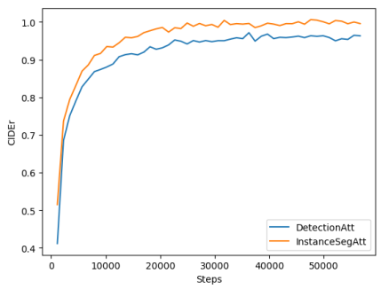
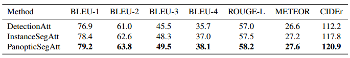

## Code of [Panoptic Segmentation-Based Attention for Image Captioning](https://www.mdpi.com/2076-3417/10/1/391)

## Requirements
- Python 2.7 (because there is no [coco-caption](https://github.com/tylin/coco-caption) version for python 3)
- PyTorch 0.4.1 (along with torchvision)
- java 1.8

## Download
```
git clone https://github.com/jamiechoi1995/PanoSegAtt.git && cd PanoSegAtt/
git clone https://github.com/tylin/coco-caption.git && cd coco-caption && ./get_stanford_models.sh && cd ..
```
Download img_fc.tar, 2CFM_resnet_feats.zip.*, trained_models.tar, stuff_cfmresnetfeat.zip.* and data.zip from https://pan.baidu.com/s/1kldKNemaXbVad_DrDXoG2g and extract them.

Result of InstanceSegAtt and DetectionAtt:


Result of PanopticSegAtt and InstanceSegAtt:


Result on Karpathy split:


Result on COCO server:


Histogram of CIDEr score:


Training curve:


Result on Dense split:


## Eval

### DetectionAtt
```
python eval.py --dump_images 0 --num_images 5000 --model models/DetectionAtt/DetectionAtt.pth --infos_path models/DetectionAtt/DetectionAtt-best.pkl --language_eval 1 --input_json data/cocotalk.json --input_label_h5 data/cocotalk_label.h5 --input_fc_dir img_fc/ --input_att_dir 2CFM_resnet_feats/crop_cfmresnetfeat
```

### InstanceSegAtt
```
python eval.py --dump_images 0 --num_images 5000 --model models/InstanceSegAtt/InstanceSegAtt.pth --infos_path models/InstanceSegAtt/InstanceSegAtt-best.pkl --language_eval 1 --input_json data/cocotalk.json --input_label_h5 data/cocotalk_label.h5 --input_fc_dir img_fc/ --input_att_dir 2CFM_resnet_feats/mask_cfmresnetfeat
```

### PanopticSegAtt
```
python eval.py --dump_images 0 --num_images 5000 --model models/PanopticSegAtt/PanopticSegAtt.pth --infos_path models/PanopticSegAtt/PanopticSegAtt-best.pkl --language_eval 1 --input_json data/cocotalk.json --input_label_h5 data/cocotalk_label.h5 --input_fc_dir img_fc/ --input_att_dir 2CFM_resnet_feats/mask_cfmresnetfeat  --input_stuff_dir stuff_cfmresnetfeat
```
